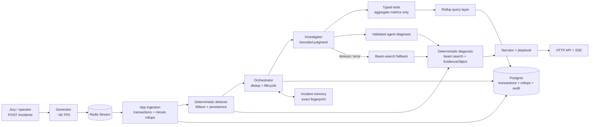

# The Control Tower

The Control Tower detects material payment-conversion drops, finds the most
likely root cause across transaction dimensions, explains the evidence and
estimated cost, and recommends a human action. It never executes remediation.

This repository is a TypeScript proof of concept for PagoTotal's payment
operations platform. The generator emits a reproducible transaction stream;
the app ingests it, aggregates minute rollups, detects statistically meaningful
drops, diagnoses one or more causes, and exposes the result through HTTP and
Server-Sent Events (SSE).

## What is implemented

- Deterministic ingestion and minute rollups for conversion and decline mix.
- Wilson confidence intervals (z = 1.96) and three-window persistence.
- Generic diagnosis over merchant, provider, country, payment method and issuer.
- Residual tests to separate root causes from correlated shadows.
- Deterministic beam-search fallback when the investigator fails or times out.
- Closed EvidenceObject assembly outside the LLM path.
- Auditable investigation_runs and investigation_steps persistence.
- Conservative cost-per-minute impact and structured recommendations requiring
  human approval.
- A parameterized incident-injection API for live trial-by-fire testing.

The current runnable surface is the generator plus the app API/SSE. The
packages/web package is not yet a runnable dashboard, so no web UI command is
claimed here.

## Architecture



The architectural boundary is deliberate:

1. Numbers are deterministic: ingestion, aggregation, detection, residual
   analysis, onset, cost and priority do not depend on an LLM.
2. Agentic judgment is bounded: the investigator chooses the next aggregate
   slice, with a tool-call budget and timeout.
3. Text is generated from a closed evidence object. The narrator cannot add a
   number that is absent from that object.

The agent never receives raw `transactions` or reads the Redis stream. Its
typed tools query only aggregate metrics from `rollup_minute` and
`rollup_declines_minute`. The deterministic scheduler can produce an
`EvidenceObject` without an agent; when the agent is used, its selected
diagnosis is validated and the same deterministic evidence builder is used. If
the agent fails, the beam-search fallback produces the diagnosis and evidence
object through the same path.

## Repository map

| Path | Responsibility |
| --- | --- |
| packages/generator | Seeded traffic generator and jury injection API |
| packages/app/src/ingest | Redis consumer, deduplication and rollups |
| packages/app/src/detect | Wilson detector, expected conversion and persistence |
| packages/app/src/diagnose | Beam search, residual test, peeling, cost and evidence |
| packages/app/src/agent | Bounded investigator, tools, fallback and narrator |
| packages/app/src/api | Health, signals, evidence, incidents, runs and SSE |
| packages/contracts | Zod contracts shared across packages |
| drizzle | Versioned PostgreSQL migrations |
| flight_logs | Decision log with alternatives and trade-offs |
| context | Product brief, data contract, detector spec and engineering rules |

## Prerequisites

- Node.js 22 or newer
- pnpm
- A reachable PostgreSQL database
- A reachable Redis instance
- An OpenAI API key for the live investigator/narrator path

There is no docker-compose.yml in this repository. The current deployment
uses managed PostgreSQL and Redis, as recorded in
[flight_logs/managed_cloud_infra.md](flight_logs/managed_cloud_infra.md).

## Configuration

```powershell
Copy-Item .env.example .env
```

Set at least these values in .env:

```dotenv
REDIS_URL=redis://...
DATABASE_URL=postgresql://...
OPENAI_API_KEY=...
```

The example also contains the generator's traffic weights and the investigator
budget. Do not commit .env; only .env.example is intended to be public.

## Run from a clean checkout

Install dependencies, apply migrations, then start the generator and app in two
terminals:

```powershell
pnpm install
pnpm db:migrate
pnpm --filter @control-tower/generator dev
pnpm --filter @control-tower/app dev
```

The default ports are:

- App API: http://localhost:4000
- Generator injection API: http://localhost:4100
- App SSE: http://localhost:4000/api/stream

Verify that the app is alive:

```powershell
Invoke-RestMethod http://localhost:4000/health
```

The first run requires the database catalog and routing-coverage data to be
available in the configured environment. The repository currently contains
migrations but does not contain a public db:seed script or seed CSV bundle;
that is an environment/bootstrap gap, not a hidden README step.

## Rehearse the live injection path

Subscribe to the event stream in one terminal:

```powershell
curl.exe -N http://localhost:4000/api/stream
```

Inject a new, generic dimension combination in another terminal. Use a start
time a few seconds in the future and replace the timestamp if necessary:

```powershell
$payload = @'
{
  "id": "jury-br-provider-001",
  "startsAt": "2026-08-30T12:00:00.000Z",
  "dimensions": {
    "providerId": "stripe",
    "country": "BR",
    "paymentMethod": "CARD"
  },
  "conversionMultiplier": 0.35,
  "declineWeights": { "91": 1 }
}
'@
Invoke-RestMethod -Method Post -Uri http://localhost:4100/incidents `
  -ContentType 'application/json' -Body $payload
```

The injection contract accepts any valid subset of the supported dimensions;
it is not a list of pre-scripted incidents. Active injections can be inspected
or removed with GET /incidents and DELETE /incidents/:id.

Useful app endpoints:

```text
GET /health
GET /api/signals
GET /api/evidence
GET /api/evidence-gaps
GET /api/incidents
GET /api/investigation-runs?incidentId=<uuid>
GET /api/investigation-runs/<runId>/steps
GET /api/conversion?from=<ISO>&to=<ISO>&country=BR
GET /api/stream
```

## The ugly cases are explicit

| Case | Handling | Evidence |
| --- | --- | --- |
| Normal noise | Merchant-level expected conversion plus statistical interval | packages/app/src/detect/expected.ts, wilson.ts |
| Low volume | INSUFFICIENT_EVIDENCE; never forced to healthy/anomalous | packages/app/src/detect/wilson.ts |
| Invalid routing cell | Only declared coverage combinations are evaluated | packages/app/src/db/schema.ts, detect/trigger.ts |
| Correlated shadows | Residual test suppresses explained deficits | packages/app/src/diagnose/residual.ts |
| Simultaneous incidents | Peeling and separate fingerprints preserve multiple causes | packages/app/src/diagnose/peeling.ts, detect/persistence.ts |
| Historical money | Local amount, USD amount, FX rate, date and source are stored | packages/app/src/db/schema.ts |
| Agent timeout/error | Typed failure returns to deterministic beam-search fallback | packages/app/src/agent, packages/app/src/diagnose/beam-search.ts |
| Unsupported narrative number | Evidence-number validation rejects it; template fallback remains available | packages/app/src/agent/narrator.ts |
| Remediation | Recommendation is recorded for human approval; nothing is executed | packages/app/src/agent/playbooks.ts |

## Decision log

The complete decision log is indexed in
[flight_logs/README.md](flight_logs/README.md). It contains more than three
real trade-offs, including:

- Wilson interval and three-window persistence instead of a fixed percentage
  threshold: [wilson_detection.md](flight_logs/wilson_detection.md)
- Managed cloud PostgreSQL/Redis instead of local Docker: [managed_cloud_infra.md](flight_logs/managed_cloud_infra.md)
- Mastra for bounded agentic judgment while keeping numeric logic deterministic: [ai_agent_module.md](flight_logs/ai_agent_module.md)
- Deterministic evidence assembly outside the agent: [who_assembles_the_evidence_object.md](flight_logs/who_assembles_the_evidence_object.md)
- Residual/peeling diagnosis for simultaneous causes: [diagnostico_por_densidade_de_deficit.md](flight_logs/diagnostico_por_densidade_de_deficit.md)

## Verification status

| Requested proof point | Status in this repository |
| --- | --- |
| Public GitHub repo with newcomer README | README added; remote is gustavo-rmontes/yuno-control-tower. Public visibility still needs checking on GitHub. |
| End-to-end clean start with no keyboard intervention | Partial: process commands and health/injection flow are documented; managed DB/Redis and missing seed bootstrap prevent a verified clean checkout run here. |
| Architecture diagram in PDF/PNG | Not complete: the architecture is documented as Mermaid in this README and context/roadmap.md, but no PDF/PNG artifact is versioned. |
| At least three decision-log trade-offs | Complete in repo; see flight_logs/README.md. |
| Ugly cases handled explicitly | Covered in the table above and by deterministic tests in packages/app and packages/generator. |
| Trial by fire rehearsed | Mechanism is present and generic via POST /incidents; a recorded rehearsal with a judge-supplied unseen combination is not present in the repo. |
| Slides link works without login and pitch is rehearsed | Not verifiable from this workspace; add the public link and rehearsal evidence before submission. |

## Tests and type checks

Run the deterministic suites and type checks with the scripts committed in the
manifests:

```powershell
pnpm test
pnpm typecheck
```

The tests cover rollups, Wilson boundaries, persistence, residual diagnosis,
simultaneous incidents, agent tool contracts, audit trails and injection
validation. Live LLM behavior is separate from these deterministic checks.

## Scope and safety

This project diagnoses payment operations; it does not route payments, change
provider configuration, or execute a remediation. All recommendations require
human approval. The supported domain is intentionally constrained to AR, MX and
BR; Stripe, Adyen and Mercado Pago; CARD and PIX, with PIX only in BR.

