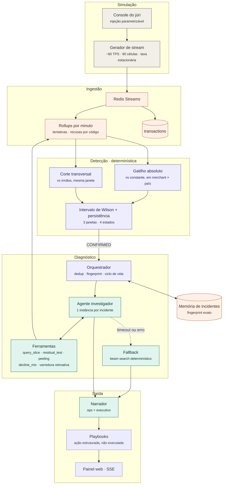

# The Control Tower — Roadmap (v4)

Atualizado após DD22. Prazo do desafio: **24 horas**. Substitui a seção de roadmap do documento de arquitetura.

Esta versão foi reescrita para **entendimento do time**: antes das fases vem uma explicação de como o sistema funciona de ponta a ponta, com um incidente inteiro percorrido passo a passo. Quem for implementar qualquer frente deveria conseguir ler as seções 1 a 3 e saber onde seu pedaço encaixa.

---

## 1. O que estamos construindo

Um sistema que assiste a um stream de transações de pagamento, percebe quando a conversão cai de verdade, e descobre sozinho **onde** o problema está dentro do cruzamento merchant × provider × país × método × emissor × decline code. Ele explica o diagnóstico com evidência, estima quanto está custando por minuto, e recomenda uma ação sem executá-la.

A regra que organiza tudo:

> **O que é número é determinístico. O que é julgamento é agêntico. O que é texto é LLM.**

Três consequências que valem para todo mundo que escreve código neste projeto:

1. O agente **nunca vê transação crua**. Ele só chama ferramentas que devolvem métrica já calculada. É isso que torna impossível ele inventar um número.
2. O narrador **nunca calcula**. Ele recebe um objeto de evidência fechado e escreve texto. Se um número aparece na narrativa, ele veio de uma coluna.
3. Todo caminho agêntico tem **fallback determinístico**. Se a API cair no meio da apresentação, o sistema continua diagnosticando.

---

## 2. Como funciona, do começo ao fim

Vale acompanhar um incidente inteiro. Os números são ilustrativos, o fluxo é o real.

**Cenário:** às 14:03, Adyen começa a recusar cartões do Itaú no Brasil.

### 14:03 — as transações entram
O gerador emite eventos normalmente. A ingestão grava cada transação em `transactions` e incrementa `rollup_minute` e `rollup_declines_minute`. Nada mais acontece nesta etapa: a ingestão não julga, só contabiliza.

### 14:04 — o detector roda a primeira vez
Duas checagens, ambas sobre a janela de 1 minuto que acabou de fechar.

**Gatilho absoluto.** O agregado do Merchant A **no Brasil** (DD17) está em 62%, contra 65% configurado em `merchants.expected_conversion`. Queda de 3pp, no limite do material. Sozinho, isso não abre nada.

**Corte transversal, profundidade 1.** Aqui aparece o sinal. Entre os filhos da raiz, na mesma janela: Adyen em 41%, Stripe em 66%, Mercado Pago em 65%. O esperado de Adyen não vem de histórico nenhum, vem dos irmãos dele agora. O intervalo de Wilson sobre a amostra de Adyen fica em [36%, 46%], inteiramente abaixo do limiar material. Mesmo o cenário mais otimista compatível com os dados já é queda.

Estado: `MONITORING`. Uma janela não abre incidente.

### 14:05 e 14:06 — persistência
O sinal se mantém nas duas janelas seguintes. Três janelas consecutivas acima de 0.95 fecham a regra. Estado: `CONFIRMED`.

**Custo total de detecção: 3 minutos.** A linha de base do briefing é "horas até alguém perceber".

### 14:06 — o orquestrador assume
Cria o incidente, calcula o fingerprint provisório, verifica se já existe incidente aberto com o mesmo fingerprint (não existe), e dispara um agente investigador dedicado a ele.

### 14:06 — o agente investiga
O agente sabe que Adyen está anômalo. Não sabe por quê. Ele faz perguntas, e cada pergunta é uma chamada de ferramenta que devolve números do rollup:

| Passo | Pergunta do agente | Resposta da ferramenta | Decisão |
|---|---|---|---|
| 1 | Adyen caiu em todos os países? | BR 38% · MX 67% · AR 66% | Fixa `country=BR` |
| 2 | Dentro de Adyen×BR, qual método? | CARD 31% · PIX 96% | Fixa `method=CARD` |
| 3 | Qual emissor? | Itaú 12% · Nubank 71% · Bradesco 69% | Fixa `issuer=Itaú` |
| 4 | Mudou o perfil de recusa? | `05` em 78%, contra 32% de baseline | Evidência de causa |

Cada linha dessa tabela vira uma linha em `investigation_steps`. É isso que aparece na tela como evidência e é isso que ganha a sabatina.

O passo 4 é o que transforma localização em diagnóstico. Saber que caiu em Adyen×BR×CARD×Itaú é localização. Saber que o código `05` saltou de 32% para 78% das recusas é a diferença entre "Adyen está degradado" e "o Itaú está recusando e a Adyen só está reportando".

### 14:06 — o teste residual confirma e limpa o eco
Neste momento, três outros nós também parecem anômalos: `country=BR`, `method=CARD`, e o merchant mais exposto à Adyen no Brasil. Um sistema ingênuo emitiria quatro alertas.

O teste residual: recalcular esses agregados **excluindo** as transações de Adyen×BR×CARD×Itaú.

- Brasil volta a 66%. Normal.
- Cartão volta a 65%. Normal.
- Merchant volta a 65%. Normal.

Resíduo limpo. Conclusão: **um incidente, não quatro.** Os outros três eram sombra. Eles são gravados com `parent_incident_id` apontando para o incidente real, e não geram alerta.

Se o resíduo **não** limpasse, isso significaria que existe um segundo incidente escondido. O loop rodaria de novo sobre o que sobrou. É o mesmo mecanismo que resolve o critério de aceitação #5 do briefing, os dois incidentes simultâneos.

### 14:06 — o "desde quando"
Varredura retroativa no `rollup_minute` da célula, de trás pra frente, procurando o início da sequência ininterrupta abaixo do esperado. Resultado: **14:03**. Sem CUSUM, sem estimativa. O instante é localizado no dado agregado, não inferido.

### 14:06 — o custo
420 tentativas afetadas × queda de 58pp = 244 aprovações perdidas, calculadas com a ponta otimista do intervalo para que o número seja um piso e não uma estimativa. Multiplicado pelo ticket médio da célula em USD, congelado com a cotação do dia. Reportado em duas leituras: acumulado, e **por minuto**, que é o número que decide prioridade.

### 14:06 — a saída
O narrador recebe o objeto de evidência fechado e produz duas versões:

- **Operações:** o quê, onde, desde quando, quantas transações, qual decline code dominante, qual a confiança.
- **Executivo:** uma linha com o dinheiro por minuto e a ação recomendada.

O motor de playbooks casa `causal_dimension=issuer` com `decline_family=issuer` e devolve uma ação estruturada, pendente de aprovação humana. O sistema não executa nada.

---

## 3. Diagrama de arquitetura



**Como ler o diagrama.** As três caixas coloridas de forma diferente são as três naturezas da regra do §1: cinza é simulação, roxo é determinístico, verde é agêntico, laranja é armazenamento. A seta pontilhada do agente para o fallback é o caminho que salva a demo. A seta de volta das ferramentas para os rollups mostra o ponto mais importante da arquitetura: **o agente só toca no dado através de ferramentas**.

---

## 4. Estado das decisões

### Travadas

| | Decisão |
|---|---|
| DD1 | Sem retry. 1 pedido = 1 tentativa |
| DD2 | Tudo síncrono. Status final no evento |
| DD3 | Valor local armazenado + normalização em USD |
| DD4 | Países: AR, MX, BR |
| DD5 | Métodos: cartão e PIX |
| DD6 | Providers: Stripe, Adyen, Mercado Pago, sem comportamento diferenciado |
| DD7 | Conversão esperada configurada por merchant, sem baseline aprendido |
| DD8 | Sem CUSUM. O "desde quando" vem de varredura retroativa |
| DD9 | Câmbio: taxa e data congeladas na transação, referência diária |
| DD10 | `account_id` = `merchant_id`, mesma entidade |
| DD11 | Intervalo de Wilson + persistência de 3 janelas |
| DD12 | Cubo = as 6 dimensões do enunciado. `card_brand` e `card_type` ficam fora |
| DD13 | 3 emissores por país, malha completa de provider × país, PIX só BR. 90 células |
| DD14 | Bucket de 1 min · `min_volume` 30 · `δ` 3pp · gerador a ~60 TPS desigual |
| DD15 | Fingerprint exato na entrega; pgvector adiado para uma extensão avaliada |
| DD16 | Só UI web, transporte SSE. Sem bot |
| DD17 | Gatilho em merchant × país |
| DD18 | Peeling para incidentes simultâneos; parcimônia como desempate |
| DD19 | Profundidade máxima da busca: 3 dimensões |
| DD20 | Harness de avaliação com 30 incidentes gerados |
| DD21 | 18 decline codes internos em 7 famílias; `diagnostic` por código é o gate; código de rede fica fora do cubo |
| DD22 | Memória agêntica isolada por run; auditoria separada em `investigation_runs` e `investigation_steps` |

### Fechadas nesta rodada, com a justificativa

| | Decisão | Por quê, em uma linha |
|---|---|---|
| DD17 | Gatilho em **merchant × país**, não só merchant | Sem isso, o emissor mexicano caindo para um único merchant pode não mover o agregado e o cenário obrigatório do briefing falha |
| DD18 | **Peeling** para incidentes simultâneos | Termina naturalmente quando o déficit residual deixa de ser material, e o caso obrigatório é disjunto. Clusterização é mais geral e mais fácil de errar sob pressão |
| — | **Parcimônia** como desempate | Entre células que explicam igualmente bem, reportar a que fixa menos dimensões. Necessário porque PIX ⇒ BR cria empates estruturais |
| DD19 | Profundidade máxima **3** | Fixar as 5 dimensões dá célula única, quase sempre específica demais e com amostra minúscula |
| — | **Sem Benjamini-Hochberg** | A poda hierárquica já reduz os testes em ordens de grandeza. Ter a resposta pronta para a sabatina vale mais que o código |
| — | Máquina de estados **enxuta**: `'open' -> 'monitoring' -> 'resolved' -> 'inconclusive'` | O estado "em recuperação" foi cortado por escopo. `em curso` atualiza sem re-alertar, que é o que evita 36 alertas num incidente de 3h |
| — | **Um modelo de LLM, rápido**, com cache por fingerprint + estado | Latência na narrativa é percebida como sistema lento, e sem cache o texto é regerado a cada atualização |
| — | **4 playbooks**, um por dimensão causal | provider · emissor · método × país · merchant |
| DD20 | **Harness de 30 incidentes**, não 200 | Vocês injetam, logo têm ground truth. 30 cabe em 24h e já dá número para o slide |

### Ainda abertas

| | Pendência | O que trava |
|---|---|---|
| P1 | Distribuição exata do tráfego entre os 3 merchants | Define quais células ficam na cauda e onde o caso de evidência insuficiente aparece |
| ~~P2~~ | ~~Decline codes~~ | ✅ **Fechada.** 13 códigos ISO 8583 para cartão e 5 códigos SPI para PIX, com 7 famílias, shares de baseline e assinaturas de incidente. Ver schema §8 |

**Consequência de DD5 a documentar:** com só cartão e PIX, e PIX existindo apenas no Brasil, a dimensão `payment_method` é constante em AR e MX. Ela não tem irmãos fora do Brasil, então o corte transversal não a usa lá. Isso é uma restrição conhecida do cubo, não um bug. Declarar no decision log antes que um juiz encontre.

---

## 5. Plano de 24 horas

Duas regras acima do cronograma. **Toda etapa termina com o sistema rodando** — nunca existe um estado em que nada funciona. E **o relógio manda**: se H+12 chegar sem o teste residual pronto, a camada agêntica é sacrificada, não o diagnóstico.

As trilhas rodam em paralelo. As horas são de relógio, não de pessoa.

### H+0 → H+3 · Fundações
**Todo mundo junto. Nada paraleliza antes disso terminar.**

- Contrato do evento congelado
- Seeds: 3 merchants, 3 providers, 3 emissores por país, 18 decline codes com família e escopo (CSV pronto), 12 linhas de `routing_coverage`, `fx_rates`
- Gerador a ~60 TPS com distribuição desigual e taxa estacionária
- Motor de injeção parametrizável nas 6 dimensões
- `docker-compose` com Redis e Postgres, migrations aplicadas

**Porta de saída:** stream rodando, `rollup_minute` populando sozinho. Se isso escorregar para H+4, cortar o harness (DD20) do escopo agora e não depois.

### H+3 → H+7 · Detecção
- Ingestão e os dois rollups
- Gatilho absoluto contra a constante do merchant, em merchant × país
- Corte transversal de profundidade 1
- Wilson com quatro estados, persistência de 3 janelas, fallback de 5 min para célula fina
- Varredura retroativa para o `started_at`

**Porta de saída:** roda 30 minutos em operação normal sem disparar; detecta em até 3 minutos um incidente injetado.
**Da demo:** critérios 1 e 2.

### H+7 → H+13 · Diagnóstico
**A etapa que decide o resultado. Se algo atrasar, que atrase em cima desta.**

- Beam search top-down, profundidade 3
- **Teste residual** com o loop de peeling
- Desempate por parcimônia
- Análise de mudança no perfil de decline codes
- Custo por minuto, conservador, local e USD
- Priorização por custo ponderado

**Porta de saída:** o cenário obrigatório do briefing sai como dois incidentes separados e ordenados.
**Da demo:** critérios 3 e 5. O sistema está completo sem uma linha de LLM.

### H+13 → H+17 · Camada agêntica
- Ferramentas envolvendo o que a etapa anterior já faz
- Investigador em Mastra, budget de 12 tools e timeout total de 45 segundos
- Sem retry interno de LLM; orquestrador determinístico inicia o beam search após falha tipada
- `investigation_runs` separando tentativas do agente e do fallback
- `investigation_steps` gravando cada pergunta, número e resumo auditável
- Narrador com saída de operações e executiva, com template determinístico de reserva

**Porta de saída:** o agente resolve os mesmos casos que o beam search resolve, e a trilha aparece na tela.
**Da demo:** critério 4 e o bônus dos dois públicos.

### H+17 → H+20 · Memória, ação e console
- Fingerprint e reconhecimento de repetição
- DD7 preservada: tempo não altera a identidade causal; contexto temporal fica como metadado de uma futura busca
- pgvector adiado; nenhum índice HNSW nesta entrega
- 4 playbooks em YAML
- Console de injeção do júri
- **Harness de 30 incidentes**, rodando em lote

**Porta de saída:** alguém de fora do time injeta sem instrução verbal e o sistema responde.

### H+20 → H+23 · Endurecimento e defesa
- Ensaio adversarial com quem não escreveu o detector
- Caso deliberado de evidência insuficiente no roteiro
- Decision log, diagrama, README
- Ensaio da sabatina: cada pessoa defende uma camada que não escreveu

### H+23 → H+24 · Congelamento
Nada de código novo. Só ensaio da demo, do começo ao fim, três vezes.

### Trilha paralela · UI
Começa em **H+3**, assim que o contrato existe, e nunca bloqueia ninguém. Mínimo viável: gráfico de conversão ao vivo, feed de incidentes, painel de evidência com o caminho do drill-down visível, console de injeção. Transporte por SSE.

O painel de evidência é o que prova o RF3. Mostrar quais dimensões foram testadas, qual concentrou o déficit e o que foi suprimido como eco vale mais do que qualquer gráfico bonito.

## 6. Dependências e divisão do time

```
F0 ──┬─> F1 ──> F2 ──> F3 ──> F5
     │                  ↑
     └─> (gerador) ──> F4
```

F4 depende de F0 e F2, mas não de F3. Pode andar em paralelo com a camada agêntica, e é a folga do cronograma.

| Frente | Escopo | Depende de |
|---|---|---|
| Dados | Gerador, injeção, console do júri, catálogos | contrato (F0) |
| Estatística | Rollups, gatilhos, intervalo de Wilson, varredura retroativa, custo | contrato |
| Diagnóstico | Beam search, teste residual, priorização | rollups |
| Agente e UI | Ferramentas, Mastra, narrador, front SSE | interface das ferramentas, pode mockar |

Quem cuida da frente de Dados **não deve** ler a implementação do detector. É isso que mantém o ensaio adversarial da F5 honesto.

---

## 7. Lista de corte, de baixo pra cima

Em 24 horas isto não é hipótese, é procedimento. Cortar nesta ordem, sem discussão no momento do corte:

1. Harness de avaliação
2. Similaridade vetorial, mantendo só o fingerprint exato
3. Reconhecimento de repetição inteiro
4. Camada agêntica completa, ficando o beam search mais o narrador

**Nunca cortar:** teste residual, console de injeção, estado de evidência insuficiente, decision log.

---

## 8. As cinco perguntas da sabatina

Resposta ensaiada de 60 segundos para cada:

1. **Como garantem que o LLM não inventa número?** O agente nunca vê transação crua. Só chama ferramentas que devolvem métrica calculada, e cada chamada fica gravada em `investigation_steps`.
2. **Por que o alerta é do provider e não do país, se o país também caiu?** Teste residual. Removendo a célula do provider, a anomalia do país desaparece. Isso está na tela.
3. **Por que não dispara com 3 recusas em 5 transações?** Com 5 tentativas o intervalo de confiança vai de 12% a 74%. Ele cobre o esperado, então não há o que afirmar. E ainda exigimos persistência de 3 janelas.
4. **Por que agente e não só algoritmo?** Escolha da ordem de exploração com conhecimento de domínio, hipóteses fora do cubo, e decisão de quando parar. O beam search determinístico existe como fallback e como linha de base de comparação.
5. **Por que não têm baseline histórico?** O esperado absoluto é configurado por merchant. A anomalia é relativa e derivada dos próprios dados em tempo real, por corte transversal entre irmãos. Menos peças móveis, sem warm-up, e nada para treinar antes da demo.
